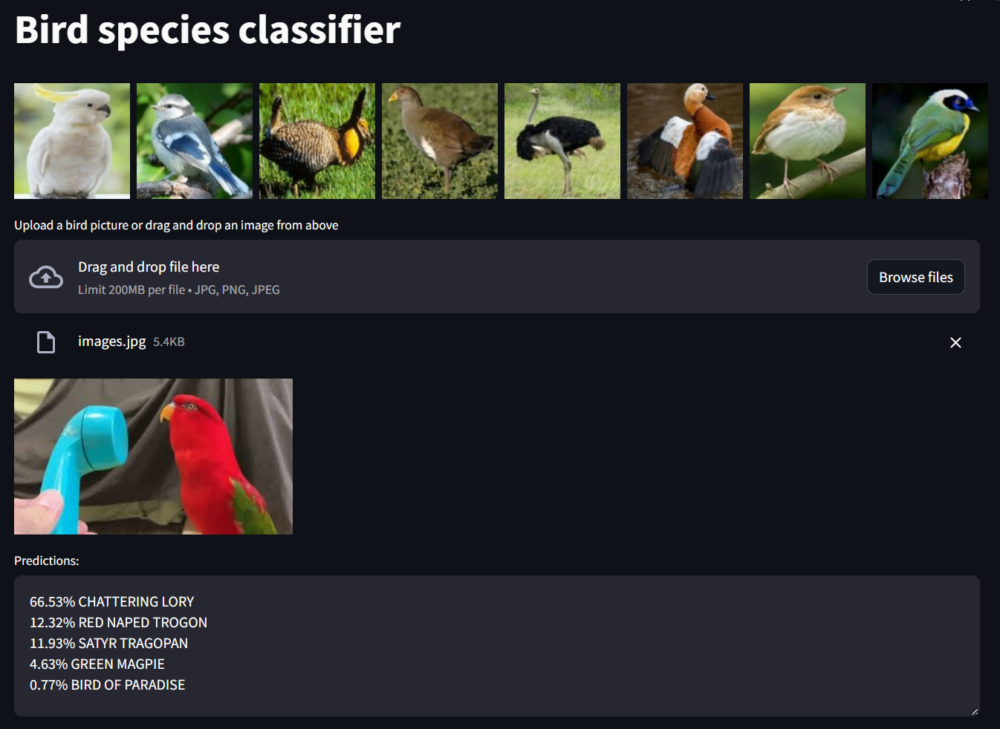

# Bird species classifier

Birds encompass a diverse range of species. While some species physically appear very different, there are many species that look very similar. Knowing which species of bird you've just encountered can be a great way to get to know the nature around you.

This model classifies images of birds into one of 525 species. The dataset used to train the model can be found here. The model is a convolutional neural network (CNN) built on top of EfficientNet-B0. You can either select one of the bird pictures, which were not used in training or validating the model, or upload a bird picture to get the 5 most likely species for that bird according to the model. For the best results, use a photo that only contains one bird that takes up most of the photo. This model has a 89.73% test accuracy and a 97.45% top 5 test accuracy. The model has also been employed in a [Streamlit app](https://bird-classifier.streamlit.app/).

Below is a screenshot from the Streamlit app.

